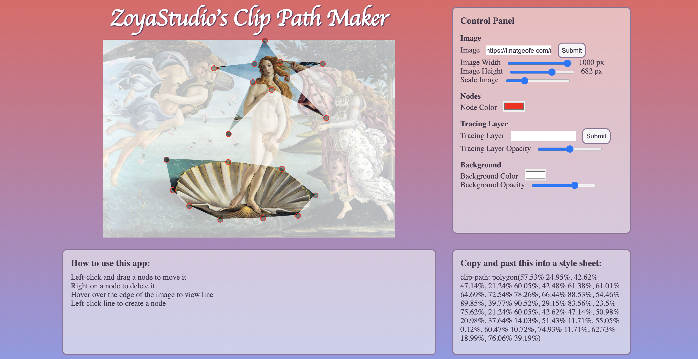

# About ZoyaStudio's Clip Path Maker
This app is a tool for generating clip-path coordinates to use as a CSS style. I made it to create intricate paths for my Character Creator app. 

Clip paths are a powerful and versatile way of cropping elements on a webpage. They have excellent browser support and can be animated. They are easy to add but difficult to create. Most GUIs for creating clip paths work best for simple shapes. 

My particular application of clip paths required unusually complex shapes and I found myself spending more time fiddling with the paths than coding. This app streamlines the workflow by allowing the user to easily add and remove nodes and overlay a ‘tracing image’ to use as a guide for the path.

Read about my path (pun intended) to discovering this wonderful CSS property [here](https://medium.com/@eamendenhall/creative-css-and-clip-path-magic-374d029e71b5). 

Try it out for yourself [here](https://floating-dusk-75152.herokuapp.com/) (give Heroku a minute to spin it up 	:slightly_smiling_face:).

   

This project was bootstrapped with [Create React App](https://github.com/facebook/create-react-app).
## How to use this App
### View Port
* Left click and drag a node to ajust its position.
* Right click on a node to delete it.
* Hover over the edge of the clip path to toggle the visibility of the line between the nearest nodes.
* Left on the line to create a new node
### Control Panel
#### Image
* Replace the source image with the text input
* Use the sliders to adjust the View Port's dimensions and scale the image
#### Nodes
* Select a new color of the nodes to increase visability
#### Tracing Layer
* Replace the source image with the text input
* Use the sliders to adjust the opacity(transparency) of the tracing layer image
#### Background
* Select a new color of the background to appropiatly screen the unclipped image.
* Use the sliders to adjust the opacity(transparency) of the background

## Available Scripts
In the project directory, you can run:

### `npm start`
Runs the app in the development mode.\
Open [http://localhost:3000](http://localhost:3000) to view it in the browser.

The page will reload if you make edits.\
You will also see any lint errors in the console.

## Future Updates

* Allow user to upload images from their local computer
* Allow snapping between nodes
* Add optional layer between clipped image and background
* Parse user provided clip-path
